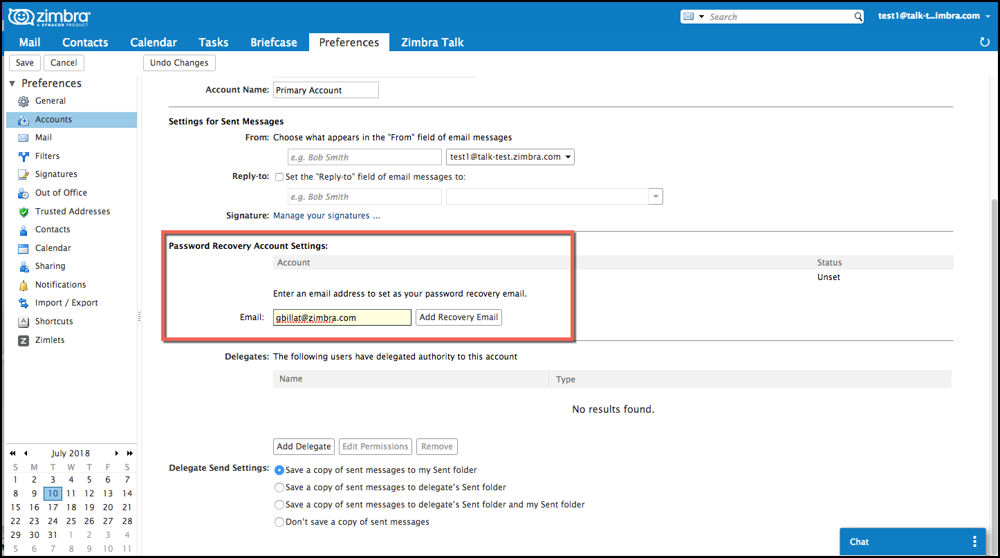

:document-title: Feature Update - Forgot Password
:product-version: 8.8.9 P1
= Feature Update - Forgot Password
v{product-version}
:toclevels: 2
:leveloffset: +1
:icons: font
:source-highlighter: coderay
:experimental:
:showlinks:
:hide-uri-scheme:

= Feature Update - Forgot Password

With Zimbra 8.8.9 (Curie Release), we have the initial [red]_beta_ release of the forgot password feature. Check the https://wiki.zimbra.com/wiki/Zimbra_Releases/8.8.9/P1[Release Notes] for more information on the patch release.

== How it works

An user will be able to reset their password using the *Forgot Password* link directly from the main login page. The pre-requisite for recovery is that the user should have configured a recovery email address. The system will send a recovery email with a temporary code to this recovery email address, which will allow the user to login back to their email.

[WARNING]
Note that this is a beta release and should [red]*not* be used in a production environment. Upgrade to `Patch 1` to test the reset password functionality.

This *_forgot password_* link will be disabled if external authentication is used. If the recovery email is not set, the user will get an error message to contact the Administrator.

== How to enable it
This feature is controlled by the `zimbraFeatureResetPasswordStatus` attribute. This can be set either at the domain level, class fo service level or at an individual user level.

[NOTE]
The domain level setting currently does not work and is a known issue.

To enable the feature for at the class of service,

[source,bash]
----
zmprov mc class_of_service zimbraFeatureResetPasswordStatus enabled
----

To disable the feature for at the class of service,

[source,bash]
----
zmprov mc class_of_service zimbraFeatureResetPasswordStatus disabled
----

The attribute can accept the following values - `enabled`, `suspended` or `disabled`.

The other attributes that have been added as part of this feature:

* _zimbraResetPasswordRecoveryCode_ - Recovery code sent to recovery email address
* _zimbraResetPasswordRecoveryCodeExpiry_ - Expiry time for password reset recovery code (Default: 10 minutes)
* _zimbraRecoveryAccountVerificationData_ - A JSON encrypted token to contain all the data need to validate a verification code for email address.
* _zimbraRecoveryAccountCodeValidity_ - Expiry time for recovery email code verification (Default: 1 day)
* _zimbraPasswordRecoveryMaxAttempts_ - Maximum attempts for password recovery resend (Default: 10)
* _zimbraFeatureResetPasswordSuspensionTime_ - time for which reset password feature is suspended (Default: 1 day)

== Setup the Password Recovery E-Mail Address

To enable the recovery of your lost password, you need to configure a `recovery email address`. Zimbra will then send you a recovery email with a temporary code that will allow you to login back and reset your forgotten password.

Here is how it works …

1. In the Zimbra Web Client, go to *menu:Preferences[Accounts > Primary Account Settings > Password Recovery Account Settings]*, and enter an email address to set as your password recovery email.
2. You will receive an email at that address with a verification code. Enter the verification code in the given field to validate this email address. In case you do not get the code, check the junk mail or you have the option to resend the code.
3. Once this email address is verified, you can start to use the reset password function.

.Setup the Recovery Email

== Password Reset Flow

1. User clicks `Forgot Password`.
2. New view/dialog appears prompting the user for an email address in order to retrieve recovery email address.
3. Submitting the email address from this view calls the internal API and the email address is validated.
+
If an email address cannot be validated, an error message is sent. User has a limited number of attempts (configurable) before being locked out.
4. Success of valid email address returns back a recovery email address that is obfuscated.
5. User is asked to confirm, so as to send a recovery code to this obfuscated email address.
6. If user continues by requesting a recovery code, a code is sent to the recovery email address while the view/dialog changes to receive code input. A timer is set and only limited attempts (configurable) will be acceptable.
7. User enters code (8-digit alpha numeric) they should have received from the message sent to recovery email.
8. If recovery code matches, an auth token or JWT, is generated and the recovery code is invalidated. If code doesn't match then user is given x number of attempts with X amount of time and is also given the option to resend the code to their recovery email address.
9. User is offered an option to continue with this current web session. _Patch 1 Update_ - User has the option to reset the password.
10. If user chooses to continue with session, then the user is authenticated and directed to their webmail.
11. If the user chooses to reset the password, a new view is shown where the user can enter their new password. Once this is validated as per the password rules, the user is taken back to the login screen and the normal login flow can continue.

[NOTE]
8.8.9 P1 has the update to allow the user to reset their password during the initial reset flow. Without this patch, the user can only get secure access to their account.

== Known Issues

* Forgot password UI work is under development for 2FA enabled users.
